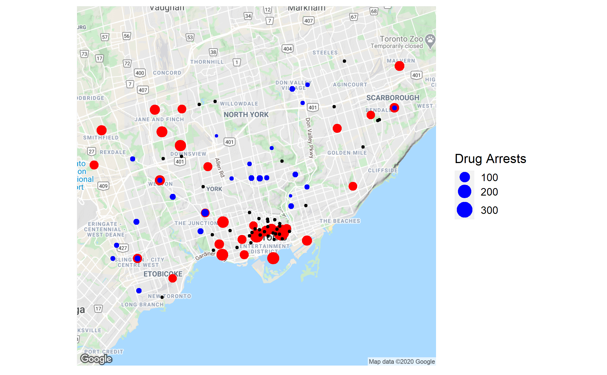

```{r, include = FALSE }

knitr::opts_chunk$set( fig.width=12, fig.height=8,
                      echo=FALSE, warning=FALSE, message=FALSE)# echo=FALSE stops the code chunk from appearing in the html document
# warning=FALSE / message=FALSE stop R warnings/messages from appearing in the knit document

library(tidyverse)
library(lubridate)
library(ggplot2)
library(ggmap)

arrests08 = read_csv("data/RawData-Ref Period 2008.csv")
arrests11 = read_csv("data/RawData-Ref Period 2011.csv")
caller_data = read_csv("data/211 Caller Data - Toronto - Needs - 2017-2019.csv")
service = read_csv("data/Ministry_of_Health_Service_Provider_Locations.csv")
neighbourhoods = read_csv("data/Neighbourhoods.csv")
#neighCodes = read_csv("data/neighbourhoodToCodes.csv")

service = service %>%
  filter(SERVICE_TYPE_DETAIL == c("Addiction Services","Addiction Services and Mental Health Services")) %>% filter(COMMUNITY == "Toronto")
```

***

<!-- (everything in here is an .html comment)

Instructions: 
- Use typical structure of data analysis report, w/ sections:
    + Introduction
    + Data
    + Analysis
    + Summary
    + Appendix (optional)
- Report should be 5 pages MAX (when compiled/knit as pdf)
- Appendix does not count towards page limit
- Put all your data in a separate "./data/" sub-folder 
- Submit compressed project folder 
- You submissions should be reproducible 
(i.e. I should be able to re-compile your report with a click of the Preview/Knit button, without having to make any changes) 

For advice on how to write such a report, see Brian Junker's note: (http://www.stat.cmu.edu/~brian/701/notes/paper-structure.pdf) 

-->


## Introduction 

The main question that is being addressed in this report mostly concerns the geographical locations of drug-related incidents and of the number of drug prevention centres stationed in the near-general area of such incidents. Incidents are focused on arrests/crimes. 

Other questions this project will be investigated on are based on the original 211 Caller Data spreadsheet provided for this project which include how many calls are made for different centres at different times, and the general age groups and genders for each caller. 

With this data, we are expecting to see general trends of drug-related incidents and drug-related calls compared with the location of centres that aim towards preventing drugs, helping people who are addicted to drugs, and rehabilitation.

## Data 

The data used for this project mainly focuses on answering the questions as stated in the Introduction. We have used datasets on drug-related crimes and drug-related arrests, which included data on valuable information such as the frequency of such incidents per neighbourhood in Toronto. 

We have also made use of the 211 Caller Data, and mostly analyzed with the variables such as postal area, level 4 name, date of call, if need was met, gender, age category, and city name. 

All the gatherings were used to create an analysis and view all the trends of incidents vs. available help. If there was any area where there were more incidents than available help, a recommendation will be made. If any area had more events in which the need was not met, and recommendation will be made especially if it is a high-incident area.

All the data and variables used in each dataset for this project is considered trustworthy as they are open public data provided by the government and other reputable sources, so there are easily collected and verified.

* The 211 Caller Data: "211 Caller Data - Toronto - Needs - 2017-2019.csv" ([211Ontario.ca](https://211Ontario.ca)).
  + This data source is the one provided by 211.
  + Some of the variables we analyze include _PostalArea_ (to find the caller locations), _Level4Name_ (to filter for most common reason for people calling), _NeedWasMet_ (to filter by whether the call met their needs or not), and _Gender_, _Age Category_, and _CityName_ (for finding demographic data and for visualization).
  + The _PostalArea_, _Gender_, and _Age Category_ variables are not going to be completely accurate since they contain a lot of _NULL_ values from people who did not want to give their personal information.
  
* Wellbeing Toronto Safety Data: "RawData-Ref Period 2008.csv" and "RawData-Ref Period 2011.csv" ([Toronto Open Data Catalog](https://open.toronto.ca/dataset/wellbeing-toronto-safety/)).
  + This data source is provided by the City of Toronto.
  + One of the files is for data recorded in 2008 and another for data recorded in 2011.
  + The two main variables we analyze are _Drug Arrests_ and _Neighbourhood_ to find the neighbourhoods that have had the most drug arrests and to find the neighbourhoods where drug activity has increased over the two years.
  + The data is a few years old now so there might be discrepencies when compared to reality.

* Ministry of Health Service Provider Locations: "Ministry_of_Health_Service_Provider_Locations.csv" ([Ontario GeoHub](https://geohub.lio.gov.on.ca/datasets/ministry-of-health-service-provider-locations)).
  + This data source is provided by the government of Ontario.
  + The main variables we use are _SERVICE_TYPE_DETAIL_ (to filter for "Addiction Services" and "Addiction Services and Mental Health Services"), _COMMUNITY_ (to filter for services located in the Toronto area), and _X_ and _Y_ (to plot the services' location on the map).
  + The data is reliable since it is provided by the provincial government and was last updated last year.

* Neighbourhoods: "Neighbourhoods.csv" ([Toronto Open Data Catalog](https://open.toronto.ca/dataset/neighbourhoods/)).
  + This data source is provided by the City of Toronto.
  + The main variables we use are _AREA_SHORT_CODE_, _LONGITUDE_, and _LATITUDE_ to plot the location of neighbourhoods on the map.
  + The data is reliable since it is provided by the government and was last updated last month.

## Analysis

The first thing we did when starting the project was figure out what part of the 211 data we wanted to focus on.

```{r results=FALSE, echo=FALSE}
caller_data %>%
  group_by(Level4Name) %>%
  filter(NeedWasMet == FALSE) %>%
  summarize(n_types = n()) %>%
  filter(Level4Name != "NULL") %>%
  arrange(-n_types)
```

After we saw that **most of the calls whose needs weren't met were calls regarding Detoxification** (shown above), we decided to make that the focus of our project. Within detoxification we decided to focus on drugs. From there we began to research which areas in Toronto had the most drug usage and which of those areas lacked services to aid citizens in the matter.

### Neighbourhood Drug Incidents

#### Incidents Per Neighbourhood

We first looked at how many incidents occurred in each neighbourhood:

```{r message=FALSE, echo=FALSE}
#Gathering information about the number of drug arrests made in each neighbourhood in 2008
col1 = arrests08 %>%
  select(Neighbourhood, "Drug Arrests") %>%
  rename(drug_arrest_2008="Drug Arrests")

#Gathering information about the number of drug arrests made in each neighbourhood in 2011
col2 = arrests11 %>%
  select(Neighbourhood, "Drug Arrests")%>%
  rename(drug_arrest_2011="Drug Arrests")

#comparing both data from 2008 and 2011
difference_graph = merge(col1, col2) %>% 
  arrange(desc(drug_arrest_2008))%>%
  mutate(Difference = drug_arrest_2011 - drug_arrest_2008)%>%
  mutate(change = sign(Difference)) %>%
  arrange(Difference)

difference_graph <- arrests11 %>% select(Neighbourhood, `Neighbourhood Id`) %>% inner_join(x = difference_graph, y = arrests11, by = "Neighbourhood")
```

```{r message=FALSE, echo=FALSE}
library(reshape)

melted = difference_graph %>%
  arrange(Difference) %>%
  select(Neighbourhood,drug_arrest_2008, drug_arrest_2011) %>%
  melt(id="Neighbourhood") %>%
  arrange(desc(value))

ggplot(melted,aes(x=reorder(Neighbourhood, -value),y=value,fill=variable)) + geom_bar(stat="identity",position = "identity", alpha=.3) + theme(axis.text.x=element_blank(), axis.ticks.x=element_blank()) +labs(y="Number of Arrests", x = "Neighbourhood")+ ggtitle("Number of Arrests made in Toronto in 2008 and 2011")

detach("package:reshape", unload=TRUE)
```

The above graph is arranged such that the neighbourhoods with the most number of drug arrest made in 2008 is on the left to the least number of arrests on the right. The red bars represent the number of drug arrest made in 2008 and the blue bars represent the number of arrest made in 2011. From this graph, we can see that in general, the number of arrests have declined within a 4 year period (2008 - 2011), specially in neighbourhoods with the most drug arrests.

#### Rate of Change of Incidents

The following graphs and tables gives are better visual of how the number of arrests have changed within 4 years:

```{r message=FALSE, echo=FALSE}
full_graph = ggplot(difference_graph, aes(x = reorder(Neighbourhood, Difference), y = Difference))+geom_bar(stat = "identity")+labs(y="Difference in Number of Arrests", x = "Neighbourhood") + theme(axis.text.x=element_blank(), axis.ticks.x=element_blank())  + ggtitle("Change in Number of Drug Arrests From 2008 to 2011 in Toronto Neighbourhoods")

#Changing the values
change_var = difference_graph[difference_graph$change == 1, "change"] <- "Increase"
change_var = difference_graph[difference_graph$change == 0, "change"] <- "No Change"
change_var = difference_graph[difference_graph$change == -1, "change"] <- "Decrease"


full_graph

change_table = difference_graph %>%
  group_by(change) %>%
  count(change)%>%
  rename(Number_of_Neighbourhoods = n)

change_table %>%
  ggplot(aes(x = change, y = Number_of_Neighbourhoods)) + geom_bar(stat = "identity") + geom_text(aes(label = Number_of_Neighbourhoods), size = 4, hjust = 0.5, vjust = -0.4, position =     "stack") 
```

There's up to 111 neighborhoods in Toronto where the number of arrests has decreased within a 4 year period from 2008 to 2011 and 25 neighborhoods where there's an increase. Even with the overall number of arrests declining, this does not mean that drug problems are not still a serious thing; there's still a large number of arrests made around Toronto dealing with drug abuse.

**With this in mind, we decided that since most of the more problematic neighbourhoods are seeing a decline in drug incidents, we would focus our efforts on the neighbourhoods that are seeing an increase in incidents as well as some of the neighbourhoods that have the most arrests.** The reason we want to focus on neighbourhoods that have an increase in arrests is so that they might not become even worse like in the estimates in the graph below:

```{r message=FALSE, echo=FALSE}
merged = merge(col1,col2) %>% 
  mutate(difference= drug_arrest_2011-drug_arrest_2008)%>%
  mutate(change = sign(difference)) %>%
  filter(change == 1) %>%
  select(Neighbourhood, drug_arrest_2008, drug_arrest_2011, difference)%>%
  arrange(desc(difference))

total_2008 = sum(merged$drug_arrest_2008)
total_2011 = sum(merged$drug_arrest_2011)
average = (total_2011/total_2008)

Year <- c("2008", "2011", "2014", "2017", "2020", "2023")
    Number_of_Arrest <- c(total_2008,
                          total_2011,
                          ceiling(total_2011*average),
                          ceiling(total_2011*average*average),
                          ceiling(total_2011*average*average*average),
                          ceiling(total_2011*average*average*average*average))
    arrests <- data.frame(Year,Number_of_Arrest)

ggplot(arrests, aes(x=Year, y=Number_of_Arrest, group=1)) +
  geom_line()+
  geom_point() +
  geom_text(aes(label = Number_of_Arrest), size = 3, hjust = 1.5, vjust = -0.4) 
```

### Service Provider Locations



The above map shows the locations of health services (black), the location of neighbourhoods with increasing drug related incidents (blue), and the location of neighbourhoods that have over 50 drug related incidents. As you can see, **there are a number of neighbourhoods that don't have a health service nearby that citizens can be referred to for help** (such as the areas West of and North of the Entertainment District), which are also some of the neighbourhoods with the biggest differences.

**This clearly shows that new health centers need to be built closer to these neighbourhoods so that more people can have access to and be referred to services that can help them. Some of these neighbourhoods could include _Islington-City Centre West_, _West Humber-Clairville_, _Humbermede_, _Humber Summit_, _Mount Pleasant West_, _Yonge-Eglinton_, and their nearby areas.**

### The Best Way To Help

Now that we know what neighbourhoods require more health services, we want to find out what demographic these neighbourhoods should expect to target so that they can provide the best service possible to the citizens.

```{r message=FALSE, echo=FALSE}
caller_data %>%
  filter(Level4Name == "Detoxification" & (PostalArea == "M9B" | PostalArea == "M9C" | PostalArea == "M9N" | PostalArea == "M9W" | PostalArea == "M4R" | PostalArea == "M4S" | PostalArea == "M6C")) %>%
  ggplot(aes(fill = `Demographics of Inquirer - Age Category`, x = `Demographics of Inquirer - Gender`)) + labs(title = "Demographics of Callers Regarding Detoxification\n(Increasing Drug Incident Neighbourhoods)", x = "Gender", y = "Number of People", fill = "Age") + geom_bar() + scale_fill_brewer(palette="Blues")

caller_data %>%
  filter(Level4Name == "Detoxification" & (PostalArea == "M3J" | PostalArea == "M6B" | PostalArea == "M1B" | PostalArea == "M8Y" | PostalArea == "M5A" | PostalArea == "M9V" | PostalArea == "M1L" | PostalArea == "M6R" | PostalArea == "M6K" | PostalArea == "M4M" | PostalArea == "M6J" | PostalArea == "M5S" | PostalArea == "M5J" | PostalArea == "M1E" | PostalArea == "L4T" | PostalArea == "M9N" | PostalArea == "M6N" | PostalArea == "M1R" | PostalArea == "M1G" | PostalArea == "M5G" | PostalArea == "M1P" | PostalArea == "M6M" | PostalArea == "M4W" | PostalArea == "M6H" | PostalArea == "M3M" | PostalArea == "M9B" | PostalArea == "M5T")) %>%
  ggplot(aes(fill = `Demographics of Inquirer - Age Category`, x = `Demographics of Inquirer - Gender`)) + labs(title = "Demographics of Callers Regarding Detoxification\n(High Drug Incident Neighbourhoods)", x = "Gender", y = "Number of People", fill = "Age") + geom_bar() + scale_fill_brewer(palette="Reds")
```

The above graphs show the demographic of callers from our target neighbourhoods calling about Detoxification. As you can see, very few people who fit into this category have called seeking help. Because of this, we no longer need to find a demographic which the new health centers should target, and a new strategy is required all together:

Due to the lack of callers in these neighbourhoods, we believe that in order to make the new health centers successful **marketing has to be done in the area to promote the 211 helpline and the new services being offered so that more people are aware of it and reach out for help.**

## Summary 

After analyzing the 211 Caller Data spreadsheet, we found out that most of the calls that failed to meet needs were calls related to detoxification, so our main topic for this report was to find a way in order to improve this area of service. We have gathered information through different datasets from reliable sources related to drug arrests, location of health centers, demographics of the callers, and the location of callers. With this information, we were able to create clear visualizations showing that health services are not present where most of the callers for detoxifications are located. **Because of this we suggest that new health centers should be built around these areas (such as the _Islington-City Centre West_, _West Humber-Clairville_, _Humbermede_, _Humber Summit_, _Mount Pleasant West_, and _Yonge-Eglinton_ neighbourhoods). We also suggest advertising and making the service more known to potential callers.**

## Appendix
```{r eval=FALSE, echo=TRUE}
caller_data %>%
  group_by(Level4Name) %>%
  filter(NeedWasMet == FALSE) %>%
  summarize(n_types = n()) %>%
  filter(Level4Name != "NULL") %>%
  arrange(-n_types)
```

The above code creates a table showing the number of times people called for each reason and didn't have their needs met.

```{r eval=FALSE, include=FALSE}
#Gathering information about the number of drug arrests made in each neighbourhood in 2008
col1 = arrests08 %>%
  select(Neighbourhood, "Drug Arrests") %>%
  rename(drug_arrest_2008="Drug Arrests")

#Gathering information about the number of drug arrests made in each neighbourhood in 2011
col2 = arrests11 %>%
  select(Neighbourhood, "Drug Arrests")%>%
  rename(drug_arrest_2011="Drug Arrests")

#comparing both data from 2008 and 2011
difference_graph = merge(col1, col2) %>% 
  arrange(desc(drug_arrest_2008))%>%
  mutate(Difference = drug_arrest_2011 - drug_arrest_2008)%>%
  mutate(change = sign(Difference)) %>%
  arrange(Difference)

difference_graph <- arrests11 %>% select(Neighbourhood, `Neighbourhood Id`) %>% inner_join(x = difference_graph, y = arrests11, by = "Neighbourhood")
```

The above code is for gathering the 2008 and 2011 Wellbeing Toronto Safety Data and finding the difference between the number of arrests reported between the years for each neighbourhood. 

```{r eval=FALSE, echo=TRUE}
# We load the reshape library here since it overrides some of R's default functions and only want it loaded when we need to.
library(reshape)

melted = difference_graph %>%
  arrange(Difference) %>%
  select(Neighbourhood,drug_arrest_2008, drug_arrest_2011) %>%
  melt(id="Neighbourhood") %>%
  arrange(desc(value))

ggplot(melted,aes(x=reorder(Neighbourhood, -value),y=value,fill=variable)) + geom_bar(stat="identity",position = "identity", alpha=.3) + theme(axis.text.x=element_blank(), axis.ticks.x=element_blank()) +labs(y="Number of Arrests", x = "Neighbourhood")+ ggtitle("Number of Arrests made in Toronto in 2008 and 2011")

# Unload the reshape library
detach("package:reshape", unload=TRUE)
```

The above code creates a graph showing the number of arrests made in each neighbourhood in both 2008 and 2011.

```{r eval=FALSE, echo=TRUE}
full_graph = ggplot(difference_graph, aes(x = reorder(Neighbourhood, Difference), y = Difference))+geom_bar(stat = "identity")+labs(y="Difference in Number of Arrests", x = "Neighbourhood") + theme(axis.text.x=element_blank(), axis.ticks.x=element_blank())  + ggtitle("Change in Number of Drug Arrests From 2008 to 2011 in Toronto Neighbourhoods")

#Changing the values
change_var = difference_graph[difference_graph$change == 1, "change"] <- "Increase"
change_var = difference_graph[difference_graph$change == 0, "change"] <- "No Change"
change_var = difference_graph[difference_graph$change == -1, "change"] <- "Decrease"

full_graph

change_table = difference_graph %>%
  group_by(change) %>%
  count(change)%>%
  rename(Number_of_Neighbourhoods = n)

change_table %>%
  ggplot(aes(x = change, y = Number_of_Neighbourhoods)) + geom_bar(stat = "identity") + geom_text(aes(label = Number_of_Neighbourhoods), size = 4, hjust = 0.5, vjust = -0.4, position =     "stack") 
```

The above code creates two graphs, both for visualizing the change in number of drug arrests from 2008 to 2011 in Toronto neighbourhoods.

```{r eval=FALSE, echo=TRUE}
merged = merge(col1,col2) %>% 
  mutate(difference= drug_arrest_2011-drug_arrest_2008)%>%
  mutate(change = sign(difference)) %>%
  filter(change == 1) %>%
  select(Neighbourhood, drug_arrest_2008, drug_arrest_2011, difference)%>%
  arrange(desc(difference))

total_2008 = sum(merged$drug_arrest_2008)
total_2011 = sum(merged$drug_arrest_2011)
average = (total_2011/total_2008)

Year <- c("2008", "2011", "2014", "2017", "2020", "2023")
    Number_of_Arrest <- c(total_2008,
                          total_2011,
                          ceiling(total_2011*average),
                          ceiling(total_2011*average*average),
                          ceiling(total_2011*average*average*average),
                          ceiling(total_2011*average*average*average*average))
    arrests <- data.frame(Year,Number_of_Arrest)

ggplot(arrests, aes(x=Year, y=Number_of_Arrest, group=1)) +
  geom_line()+
  geom_point() +
  geom_text(aes(label = Number_of_Arrest), size = 3, hjust = 1.5, vjust = -0.4) 
```

The above code creates a line graph that shows an estimate of how high drug related arrests could get in neighbourhoods where those arrests are currently increasing if nothing is done about the situation.

```{r eval=FALSE, echo=TRUE}
joint <- neighbourhoods %>% rename(`Neighbourhood Id` = AREA_SHORT_CODE) %>% inner_join(x = ., y = arrests11, by = "Neighbourhood Id") %>% filter(`Drug Arrests` > 50)

diff = difference_graph %>% filter(`Difference` > 0)

diff_joint <- neighbourhoods %>% rename(`Neighbourhood Id` = AREA_SHORT_CODE) %>% inner_join(x = ., y = diff, by = "Neighbourhood Id")

# For security, please provide your own key to use the Google Maps Static API.
# Here is a link on how to do this: https://www.littlemissdata.com/blog/maps
register_google(key = "[YOUR KEY GOES HERE]")

TorontoMap <- ggmap(get_googlemap(center = c(-79.398, 43.698), zoom = 11, scale = 4, maptype ='terrain', color = 'color')) +
    theme(axis.title.x=element_blank(),
        axis.text.x=element_blank(),
        axis.ticks.x=element_blank(),
        axis.title.y=element_blank(),
        axis.text.y=element_blank(),
        axis.ticks.y=element_blank(),
        legend.key.size = unit(0.3, "cm"))

TorontoMap + geom_point(data = joint, aes(x = LONGITUDE, y = LATITUDE, size = `Drug Arrests`), color = "red") + geom_point(data = diff_joint, aes(x = LONGITUDE, y = LATITUDE, size = `Difference`), color = "blue") + geom_point(data = service, aes(x = X, y = Y), size = 1)
```

The above code creates a map showing the neighbourhoods in Toronto that have an increase in drug arrests and a high number of drug arrests with the locations of health services overlapping.

```{r eval=FALSE, echo=TRUE}
caller_data %>%
  filter(Level4Name == "Detoxification" & (PostalArea == "M9B" | PostalArea == "M9C" | PostalArea == "M9N" | PostalArea == "M9W" | PostalArea == "M4R" | PostalArea == "M4S" | PostalArea == "M6C")) %>%
  ggplot(aes(fill = `Demographics of Inquirer - Age Category`, x = `Demographics of Inquirer - Gender`)) + labs(title = "Demographics of Callers Regarding Detoxification\n(Increasing Drug Incident Neighbourhoods)", x = "Gender", y = "Number of People", fill = "Age") + geom_bar() + scale_fill_brewer(palette="Blues")

caller_data %>%
  filter(Level4Name == "Detoxification" & (PostalArea == "M3J" | PostalArea == "M6B" | PostalArea == "M1B" | PostalArea == "M8Y" | PostalArea == "M5A" | PostalArea == "M9V" | PostalArea == "M1L" | PostalArea == "M6R" | PostalArea == "M6K" | PostalArea == "M4M" | PostalArea == "M6J" | PostalArea == "M5S" | PostalArea == "M5J" | PostalArea == "M1E" | PostalArea == "L4T" | PostalArea == "M9N" | PostalArea == "M6N" | PostalArea == "M1R" | PostalArea == "M1G" | PostalArea == "M5G" | PostalArea == "M1P" | PostalArea == "M6M" | PostalArea == "M4W" | PostalArea == "M6H" | PostalArea == "M3M" | PostalArea == "M9B" | PostalArea == "M5T")) %>%
  ggplot(aes(fill = `Demographics of Inquirer - Age Category`, x = `Demographics of Inquirer - Gender`)) + labs(title = "Demographics of Callers Regarding Detoxification\n(High Drug Incident Neighbourhoods)", x = "Gender", y = "Number of People", fill = "Age") + geom_bar() + scale_fill_brewer(palette="Reds")
```

The above code creates a graph that shows the demographics of callers in certain neighbourhoods that have called regarding detoxification.
